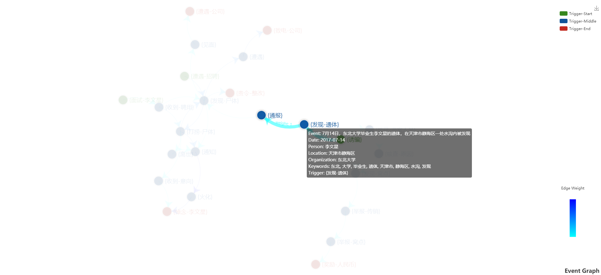
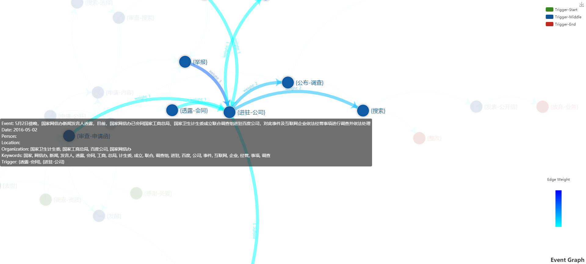
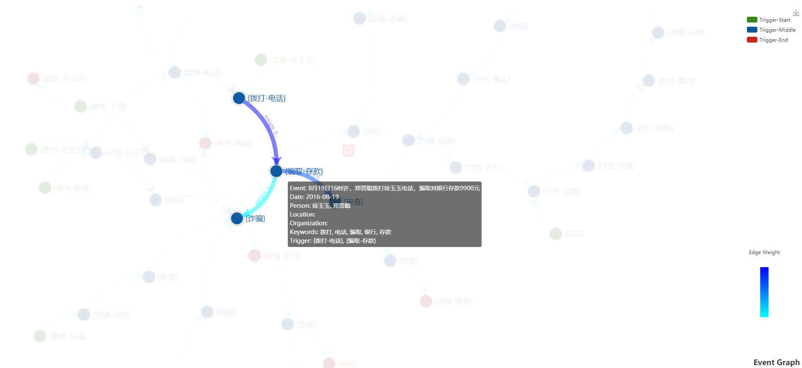

# EventGraph
Generate an event graph from multiple texts on the same event topic.
# 项目介绍
通过对同一话题事件不同新闻报道的分析，梳理事件内各子事件间的时序关系并以图谱的形式进行结构化表示。  
其涉及技术包括事件抽取、实体抽取、{触发词-论元}抽取、事件关系构建等。　
# 使用方式
MainDeal: XX.txt -> XX.xml 入口函数为BackMain.java。  
Web: web->Graph.html  在搜索框中输入data文件夹中的文件名(不含.xml)得到相应的展示图。例如: 输入"李文星_Sample"则会读取"李文星_Sample.xml"中的数据并进行展示。
　
# 事件图谱举例
1) 李文星事件(李文星_Sample.xml文件)　

2) 魏则西事件(魏则西.xml文件)　

3) 徐玉玉事件(徐玉玉.xml文件)　　

# 总结
1) 项目目前正处于实验阶段, 其性能和算法尚有许多不足。
2) 相关的模型和lib太大了, 所以并没有放在该项目中。
# Question?
 send mail to duanjian56@126.com  
